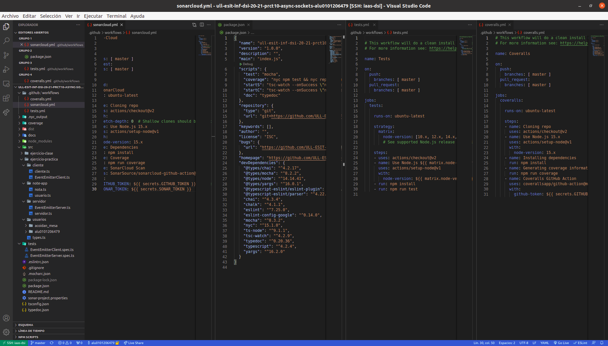

# Informe
## Práctica 10 - Cliente y servidor para una aplicación de procesamiento de notas de texto
### Desarrollo de Sistemas Informáticos
### ACOIDAN MESA HERNANDEZ - alu0101206479@ull.edu.es

#### Introducción
Esto es un informe para poder llevar a cabo la **Práctica 10 - Cliente y servidor para una aplicación de procesamiento de notas de texto**, hemos vuelto a crear una estructura de directorios adecuada (algo que ya sabíamos de prácticas anteriores), añadiendole el uso del generador de documentación [TypeDoc](https://typedoc.org/) y el uso de [Mocha](https://mochajs.org/) (Marco de pruebas rico en funciones) con [Chai](https://www.chaijs.com/) (Librería de aserciones BDD / TDD para node y el navegador que se puede combinar con cualquier marco de pruebas JS o TS, en este caso lo hemos configurado con Mocha). También hemos añadido [Instanbul](https://istanbul.js.org/) (Una herramienta que permite obtener informes sobre el cubrimiento del código fuente llevado a cabo por las pruebas que haya diseñado), hemos aplicado la integración continua mediante [GitHub Actions](https://docs.github.com/en/actions) (permite crear flujos de trabajo que se pueden utilizar para compilar, probar y desplegar código, dando la posibilidad de crear flujos de integración y despliegue continuo dentro del propio repositorio de git) y hemos aplicado la comprobación de la calidad y seguridad del código fuente mediante [Sonar Cloud](https://sonarcloud.io/) (Plataforma de análisis de código continuo y online con la que puedes analizar tus proyectos y ver los resultados online en la nube) y GitHub Actions.

A parte, como se ha llevado a cabo la metodología **TDD**, hemos reforzado nuestros conocimientos sobre ello una vez más. Y también hemos vuelto a utilizar la aplicación de notas de la **[práctica 8](https://ull-esit-inf-dsi-2021.github.io/ull-esit-inf-dsi-20-21-prct08-filesystem-notes-app-alu0101206479/)**, la cual hemos tenido que modificar para adaptarla a nuestra nueva aplicación con **cliente-servidor**. Hemos aprendido a **escribir un servidor y un cliente haciendo uso de los sockets proporcionados por el [módulo `net` de Node.js](https://nodejs.org/dist/latest-v16.x/docs/api/net.html) y de [la clase `EventEmitter` del módulo `Events` de Node.js](https://nodejs.org/dist/latest-v16.x/docs/api/events.html#events_class_eventemitter)** y a aplicar los **principios SOLID** una vez más. En este informe se mostrará la solución diseñada para la aplicación de procesamiento de notas de texto usando un cliente y un servidor.

También cabe destacar que hemos usado de nuevo los [issues de Github](https://guides.github.com/features/issues/), ya que era por dónde único podríamos comunicarle al profesorado cualquier tipo de incidencia relacionada con la práctica.

#### Objetivos
Los objetivos de esta práctica han sido crear la estructura de directorios adecuada para trabajar, añadiendole el generador de documentación TypeDoc, el uso del marco de pruebas Mocha con la libreria Chai y Instanbul para obtener un informe de cubrimiento de nuestro código cada vez que ejecutasemos las pruebas. También debimos aplicar la integración continua mediante GitHub Actions y aplicar la comprobación de seguridad y calidad del código mediante SonarCloud y GitHub Actions, aparta de usar los paquetes chalk y yargs. Pero lo principal ha sido implementar un cliente y un servidor para la aplicación de procesamiento de notas de texto de la [práctica 8](https://ull-esit-inf-dsi-2021.github.io/ull-esit-inf-dsi-20-21-prct08-filesystem-notes-app-alu0101206479/), esto nos lo pedían en el [enunciado](https://ull-esit-inf-dsi-2021.github.io/ull-esit-inf-dsi-20-21-prct08-filesystem-notes-app-alu0101206479/).

#### Crear la estructura básica y adecuada del proyecto, añadiendole el generador de documentación TypeDoc, el uso del marco de pruebas Mocha con la librería Chai, la herramienta Instanbul, la aplicación de GitHub Actions y la aplicación de SonarCloud
Para crear la [estructura básica del proyecto](https://ull-esit-inf-dsi-2021.github.io/typescript-theory/typescript-project-setup.html), lo haremos como lo hicimos en prácticas anteriores (Estará el enlace al informe de esta en la bibliografía), también podemos pinchar el hiperenlace adjuntado que se encontrará disponible también en la bibliografía.

Instalaremos Instanbul a través de la siguiente guía:

  * [https://istanbul.js.org/](https://istanbul.js.org/)

Lo instalamos para que en cada ejecución de las pruebas nos salga un informe de cubrimiento de nuestro código, algo como lo siguiente:

Posteriormente, para configurar y aprender a usar el generador de configuración [TypeDoc](https://typedoc.org/) y el marco de pruebas [Mocha](https://mochajs.org/) con la librería [Chai](https://www.chaijs.com/), la aplicación de [GitHub Actions](https://docs.github.com/en/actions) y la aplicación de [SonarCloud](https://sonarcloud.io/) podremos consultar la documentación o pinchar en los siguientes hiperenlaces a vídeos explicativos (Estos enlaces también se encuentran en la bibliografía):

  * [Vídeo de ejemplo de instalación y configuración de TypeDoc en un proyecto TypeScript](https://drive.google.com/file/d/19LLLCuWg7u0TjjKz9q8ZhOXgbrKtPUme/view)
  * [Vídeo de ejemplo de instalación y configuración de Mocha y Chai en un proyecto TypeScript](https://drive.google.com/file/d/1-z1oNOZP70WBDyhaaUijjHvFtqd6eAmJ/view?usp=sharing)
  * [Vídeo de ejemplo de integración continua de código fuente TypeScript ejecutado en Node.js a través de una GitHub Action](https://drive.google.com/file/d/1hwtPovQlGvthaE7e7yYshC4v8rOtLSw0/view)
  * [Vídeo de ejemplo de configuración de workflow de GitHub Actions para enviar información de cubrimiento a Coveralls](https://drive.google.com/file/d/1yOonmpVbOyvzx3ZbXMQTAPxvA3a7AE7w/view?usp=sharing)
  * [Vídeo de ejemplo de configuración de workflow de GitHub Actions para comprobar la calidad y seguridad del código fuente con Sonar Cloud](https://drive.google.com/file/d/1FLPargdPBX6JaJ_85jNsRzxe34sMi-Z3/view?usp=sharing)

Finalmente, nos tiene que quedar algo parecido a lo siguiente (Se muestra a la izquierda la estructura y en el medio algunos archivos abiertos para que se vea su interior):

#### Cliente y servidor en la aplicación de procesamiento de notas de texto
En cuanto al diseño y la estructura decidida para implementar un cliente y un servidor en la aplicación la veremos a continuación, podemos ver los requisitos del cliente y del servidor [en el enunciado de la práctica 10](https://ull-esit-inf-dsi-2021.github.io/prct10-async-sockets/). Todo el código fuente estará alojado en el directorio `src/ejercicio-practica`, dentro de este, habrán varios subdirectorios y el fichero `types.ts`, donde se almacenan los tipos que se utilizarán. Los subdirectorios recientemente nombrados son `note-app` (donde se almacena la aplicación de notas de texto, dentro de este se encuentran los ficheros `nota.ts` y `usuario.ts`), `cliente` (donde se almacena el código del cliente, dentro de este encontramos el fichero `EventEmitterCliente.ts` y `cliente.ts`), `servidor` (donde se almacena el código del servidor, dentro de este encontramos el fichero `EventEmitterServidor.ts` y `servidor.ts`) y por último el subdirectorio `usuarios` (El cual contendrá más subdirectorios que serán los directorios de cada usuario y dentro de estos se encuentran las notas de cada usuario en alrchivos `JSON`.

Cabe destacar que también se debe aportar la documentación mediante el uso de TypeDoc y usar una metodología de desarrollo dirigido por pruebas/comportamiento. El código fuente de las pruebas deberá estar alojado en un fichero (`aplicacion.spec.ts`) dentro del directorio `tests/`.

##### Clases de la aplicación de notas
Para la aplicación de notas como el uso de **yargs** ahora lo gestiona el cliente (El cual explicaremos posteriormente), el fichero `note-app.ts` de la [práctica 8](https://ull-esit-inf-dsi-2021.github.io/ull-esit-inf-dsi-20-21-prct08-filesystem-notes-app-alu0101206479/) ha desaparecido y nos quedaremos con las siguientes clases:

  * Clase `Nota`: Es una clase que representa una nota. Su código lo podremos observar en el siguiente enlace:

      [https://github.com/ULL-ESIT-INF-DSI-2021/ull-esit-inf-dsi-20-21-prct10-async-sockets-alu0101206479/blob/master/src/ejercicio-practica/note-app/nota.ts](https://github.com/ULL-ESIT-INF-DSI-2021/ull-esit-inf-dsi-20-21-prct10-async-sockets-alu0101206479/blob/master/src/ejercicio-practica/note-app/nota.ts)
          
    Esta clase contendrá los siguientes atributos privados:
      * `titulo`: Título de la nota (String) 
      * `cuerpo`: Cuerpo de la nota (String)
      * `color`: Color de la nota (String)

    Y contendrá las siguientes funciones públicas:
      * `getTitulo()`: Función para obtener el atributo privado `titulo`
      * `setTitulo(titulo: string)`: Función para cambiar el atributo privado `titulo`
      * `getCuerpo()`: Función para obtener el atributo privado `cuerpo`
      * `setCuerpo(cuerpo: string)`: Función para cambiar el atributo privado `cuerpo`
      * `getColor()`: Función para obtener el atributo privado `color`
      * `setColor(color: string)`: Función para cambiar el atributo privado `color`

  * Clase `Usuario`: Es una clase que representa a los usuarios que utilizan la aplicación de notas, cuando se construye un objeto de esta clase, al atributo `notas` se le introducen las notas correspondientes del usuario, que se han sacado de leer el contenido de su directorio correspondiente. Pero, si el usuario no tiene su directorio correspondiente, pues se le crea. Su código lo podremos observar en el siguiente enlace:

      [https://github.com/ULL-ESIT-INF-DSI-2021/ull-esit-inf-dsi-20-21-prct10-async-sockets-alu0101206479/blob/master/src/ejercicio-practica/note-app/usuario.ts](https://github.com/ULL-ESIT-INF-DSI-2021/ull-esit-inf-dsi-20-21-prct10-async-sockets-alu0101206479/blob/master/src/ejercicio-practica/note-app/usuario.ts)
      
    Esta clase contendrá los siguientes atributos privados:
      * `nombre`: Nombre del usuario (String) 
      * `notas`: Notas del usuario (Nota[]) 

    Y contendrá las siguientes funciones públicas (Las cuales se han modificado internamente con respecto a la [práctica 8](https://ull-esit-inf-dsi-2021.github.io/ull-esit-inf-dsi-20-21-prct08-filesystem-notes-app-alu0101206479/):
      * `getNombre()`: Función para obtener el atributo privado `nombre`
      * `setNombre(nombre: string)`: Función para cambiar el atributo privado `nombre`
      * `getNotas()`: Función para obtener el atributo privado `notas`
      * `añadirNota(titulo: string, cuerpo: string, color: string)`: Función que le añade una nota al usuario, tanto al atributo notas con la función `push(nota)`, como al directorio del usuario con la función `fs.writeFileSync(ruta, texto, manejador)` y devuelve `true` o `false` dependiendo si la operación se ejecutó correctamente o no
      * `modificarNota(tituloNota: string, parametroEditar: string, nuevoValor: string)`: Función que le modifica un atributo concreto a una nota del usuario, tanto en el atributo notas (Con las funciones correspondientes para ello de la clase `Nota`), como  en el directorio del usuario (Con la función `fs.writeFileSync(ruta, texto, manejador)` para editar tanto el título, como el cuerpo, como el color y usando la función `fs.renameSync(titulo viejo, titulo nuevo)` para cambiar el nombre del fichero cuando se cambie el título) y retorna true o false si se modifico la nota correctamente o no.
      * `borrarNota(titulo: string)`: Función que le borra una nota concreta al usuario, lo primero que se hace es comprobarse si la nota existe con la función `fs.existSync(ruta titulo)` y si existe la nota se borra tanto del atributo notas (Con la función `splice(indice, 1)`, como del directorio del usuario (Con la función `fs.rm(ruta, manejador)`) y retorna true o false dependiendo si se borró la nota o no
      * `listarNotas()`: Función para listar los titulos de todas las notas del usuario y retorna todas las notas de este
      * `leerNota(titulo: string)`: Función para leer una nota concreta del usuario que retorna un JSON con la nota que se quiere leer y si se ha encontrado o no.

Las pruebas de estas clases se pueden observar en el siguiente enlace:

  [https://github.com/ULL-ESIT-INF-DSI-2021/ull-esit-inf-dsi-20-21-prct08-filesystem-notes-app-alu0101206479/blob/master/tests/aplicacion.spec.ts](https://github.com/ULL-ESIT-INF-DSI-2021/ull-esit-inf-dsi-20-21-prct08-filesystem-notes-app-alu0101206479/blob/master/tests/aplicacion.spec.ts)
  
Y la salida de estas pruebas al ejecutar `npm run test` debería ser la siguiente. Pero antes, cabe destacar, que si se van a probar las pruebas más de una vez, cada vez que las probemos, deberemos borrar el directorio que se crea con las pruebas, el cual es `/src/aplicacion/usuarios/usuario_prueba`:

  

##### Cliente
La implementación del cliente, se realiza en el fichero `src/ejercicio-practica/cliente/cliente.ts`, en este se utiliza la clase `EventEmitterClient`, esta clase sirve para que el cliente se pueda conectar correctamente con el servidor y arregla el problema de los envíos de mensajes por partes ya que detecta cuando el servidor no va a mandar más mensajes (Cuando el servidor emite el evento `end`) y cuando lo detecta, esta clase emite el evento `response`. 

El cliente realizará una petición al servidor con diferentes comandos gestionados por **yargs** que son los siguientes:
  * `add`: Le solicita al servidor que añada una nota al usuario, se le tiene que pasar como parámetros el usuario (`--user="usuario"`), el título de la nota (`--title="Título"`), el cuerpo de la nota (`--body="Cuerpo"`) y el color de la nota, que se pueden poner 4 colores, **red, blue, green o yellow** (`--color="blue"`)
  * `modify`: Le solicita al servidor que modifique un parámetro concreto de una nota, se le tiene que pasar como parámetro obligatoriamente el usuario (`--user="usuario"`) y el título de la nota (`--title="Título"`) y opcionalmente el nuevo valor del campo que se quiere cambiar, el título (`--newTitle="Nuevo Título"`), el cuerpo (`--newBody="Nuevo Cuerpo"`) o el color (`--newColor="red"`)
  * `remove`: Le solicita al servidor que borre una nota concreta al usuario, se le tiene que pasar como parámetros el usuario (`--user="usuario"`) y el título de la nota (`--title="Título"`)
  * `list`: Le solicita al servidor que le liste los títulos de las notas de los usuarios, se le tiene que pasar como parámetro el usuario (`--user="usuario"`)
  * `read`: Le solicita al servidor que le lea una nota concreta al usuario, se le tiene que pasar como parámetros el usuario (`--user="usuario"`) y el título de la nota (`--title="Título"`)

Después de realizar la petición, una vez el servidor ha procesado la solicitud y contesta, el objeto de la clase `EventEmitterClient` emite el evento `response` con la respuesta del servidor al cliente. Para este, se ha implementado un manejador que a través de un `switch`, según el tipo de respuesta y si salió bien o mal la operación, le muestra al cliente por consola un mensaje u otro, utilizando el paquete **chalk** para mostrarlos con colores.

Las pruebas de la clase `EventEmitterClient` se pueden observar en el siguiente enlace:

  [https://github.com/ULL-ESIT-INF-DSI-2021/ull-esit-inf-dsi-20-21-prct10-async-sockets-alu0101206479/blob/master/tests/EventEmitterClient.spec.ts](https://github.com/ULL-ESIT-INF-DSI-2021/ull-esit-inf-dsi-20-21-prct10-async-sockets-alu0101206479/blob/master/tests/EventEmitterClient.spec.ts)
  
Y la salida de estas pruebas al ejecutar `npm run test` debería ser la siguiente:

  

##### Servidor
La implementación del servidor, se realiza en el fichero `src/ejercicio-practica/servidor/servidor.ts`, en este se utiliza la clase `EventEmitterServer`, esta clase sirve para que el servidor se pueda conectar correctamente con el cliente y arregla el problema de los envíos de mensajes por partes ya que detecta cuando el cliente no va a mandar más mensajes (Cuando el mensaje contiene `\n`) y cuando lo detecta, esta clase emite el evento `request`. 

Después de que el cliente envie la petición, el servidor la reciba y la clase `EventEmitterServer` emita el evento `request`. Para este evento se ha implementado un manejador, el cual a través de un switch ejecuta las operaciones que le pide el cliente, procesa la respuesta, y de ahi le envía al cliente un JSON con la respuesta, la cual contiene el tipo de la peticion, si se realizó correctamente la petición o no, y si fuera nacesario la nota o las notas (En el caso de `read` y `list`) o el campo que se modifico (En el caso de `modified`).

Las pruebas de la clase `EventEmitterServer` se pueden observar en el siguiente enlace:

  [https://github.com/ULL-ESIT-INF-DSI-2021/ull-esit-inf-dsi-20-21-prct10-async-sockets-alu0101206479/blob/master/tests/EventEmitterServer.spec.ts](https://github.com/ULL-ESIT-INF-DSI-2021/ull-esit-inf-dsi-20-21-prct10-async-sockets-alu0101206479/blob/master/tests/EventEmitterServer.spec.ts)
  
Y la salida de estas pruebas al ejecutar `npm run test` debería ser la siguiente:

  

#### Conclusiones
Como conclusión a la práctica, me ha parecido bastante interesante el uso de sockets para implementar un servidor y un cliente, es bastante importante, ya que hoy en día, casi toda la informática se basa en eso.

Poco a poco viendo diversos artículos me voy dando cuenta de que TypeScript es muy útil en la actualidad y me alegra mucho aprender a usarlo cada vez más.

#### Bibliografía

Nombre | Enlaces
-------|--------
Enunciado de la práctica 10 | [https://ull-esit-inf-dsi-2021.github.io/prct10-async-sockets/](https://ull-esit-inf-dsi-2021.github.io/prct10-async-sockets/)
Enunciado de la práctica 8 | [https://ull-esit-inf-dsi-2021.github.io/ull-esit-inf-dsi-20-21-prct08-filesystem-notes-app-alu0101206479/](https://ull-esit-inf-dsi-2021.github.io/ull-esit-inf-dsi-20-21-prct08-filesystem-notes-app-alu0101206479/)
Apuntes de la asignatura | [https://ull-esit-inf-dsi-2021.github.io/nodejs-theory/](https://ull-esit-inf-dsi-2021.github.io/nodejs-theory/)
TypeDoc | [https://typedoc.org/](https://typedoc.org/)
Mocha | [https://mochajs.org/](https://mochajs.org/)
Chai | [https://www.chaijs.com/](https://www.chaijs.com/)
Yargs | [https://www.npmjs.com/package/yargs](https://www.npmjs.com/package/yargs)
Chalk | [https://www.npmjs.com/package/chalk](https://www.npmjs.com/package/chalk)
Módulo net de Node.js | [https://nodejs.org/dist/latest-v16.x/docs/api/net.html](https://nodejs.org/dist/latest-v16.x/docs/api/net.html)
EventEmitter del módulo Events de Node.js | [https://nodejs.org/dist/latest-v16.x/docs/api/events.html#events_class_eventemitter](https://nodejs.org/dist/latest-v16.x/docs/api/events.html#events_class_eventemitter)
Tutorial de creación de la estructura básica del proyecto | [https://ull-esit-inf-dsi-2021.github.io/typescript-theory/typescript-project-setup.html](https://ull-esit-inf-dsi-2021.github.io/typescript-theory/typescript-project-setup.html)
Vídeo de ejemplo de instalación y configuración de TypeDoc en un proyecto TypeScript | [https://drive.google.com/file/d/19LLLCuWg7u0TjjKz9q8ZhOXgbrKtPUme/view](https://drive.google.com/file/d/19LLLCuWg7u0TjjKz9q8ZhOXgbrKtPUme/view)
Repositorio GitHub con el ejemplo de configuración de TypeDoc en un proyecto TypeScript | [https://github.com/ULL-ESIT-INF-DSI-2021/doc-test](https://github.com/ULL-ESIT-INF-DSI-2021/doc-test)
Vídeo de ejemplo de instalación y configuración de Mocha y Chai en un proyecto TypeScript | [https://drive.google.com/file/d/1-z1oNOZP70WBDyhaaUijjHvFtqd6eAmJ/view](https://drive.google.com/file/d/1-z1oNOZP70WBDyhaaUijjHvFtqd6eAmJ/view)
Repositorio GitHub con el ejemplo de configuración de Mocha y Chai en un proyecto TypeScript | [https://github.com/ULL-ESIT-INF-DSI-2021/doc-test](https://github.com/ULL-ESIT-INF-DSI-2021/doc-test)
Issues de Github | [https://guides.github.com/features/issues/](https://guides.github.com/features/issues/)
Instanbul | [https://istanbul.js.org/](https://istanbul.js.org/)
Coveralls | [ https://coveralls.io/](https://coveralls.io/)
Vídeo de ejemplo con cubrimiento de código mediante Instanbul y Coveralls | [https://drive.google.com/file/d/1xLDc4CpoYpsAlCFO_4DMwu7MKCtcZDnh/view?usp=sharing](https://drive.google.com/file/d/1xLDc4CpoYpsAlCFO_4DMwu7MKCtcZDnh/view?usp=sharing)
Repositorio GitHub con el ejemplo de cubrimiento de código mediante Instanbul y Coveralls | [https://github.com/ULL-ESIT-INF-DSI-2021/coveralls-typescripthttps://github.com/ULL-ESIT-INF-DSI-2021/coveralls-typescript](https://github.com/ULL-ESIT-INF-DSI-2021/coveralls-typescript)
GitHub Actions | [https://docs.github.com/en/actions](https://docs.github.com/en/actions)
Vídeo de ejemplo de integración continua de código fuente TypeScript ejecutado en Node.js a través de una GitHub Action | [https://drive.google.com/file/d/1hwtPovQlGvthaE7e7yYshC4v8rOtLSw0/view?usp=sharing](https://drive.google.com/file/d/1hwtPovQlGvthaE7e7yYshC4v8rOtLSw0/view?usp=sharing)
Vídeo de ejemplo de configuración de workflow de GitHub Actions para enviar información de cubrimiento a Coveralls | [https://drive.google.com/file/d/1yOonmpVbOyvzx3ZbXMQTAPxvA3a7AE7w/view?usp=sharing](https://drive.google.com/file/d/1yOonmpVbOyvzx3ZbXMQTAPxvA3a7AE7w/view?usp=sharing)
Repositorio GitHub con ejemplo de GitHub Action para llevar a cabo integración continua y cubrimiento de código | [https://github.com/ULL-ESIT-INF-DSI-2021/github-actions-typescript-nodejs-ci](https://github.com/ULL-ESIT-INF-DSI-2021/github-actions-typescript-nodejs-ci)
SonarCloud | [https://sonarcloud.io/](ttps://sonarcloud.io/)
Vídeo de ejemplo de configuración de workflow de GitHub Actions para comprobar la calidad y seguridad del código fuente con Sonar Cloud | [https://drive.google.com/file/d/1FLPargdPBX6JaJ_85jNsRzxe34sMi-Z3/view?usp=sharing](https://drive.google.com/file/d/1FLPargdPBX6JaJ_85jNsRzxe34sMi-Z3/view?usp=sharing)
Repositorio GitHub con ejemplo de GitHub Action para comprobar la calidad y seguridad del código fuente mediante Sonar Cloud | [https://github.com/ULL-ESIT-INF-DSI-2021/github-actions-sonar-cloud](https://github.com/ULL-ESIT-INF-DSI-2021/github-actions-sonar-cloud)
